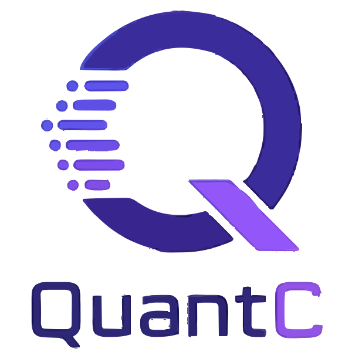

<div align="center">



> A modern, expressive systems language that transpiles to C++ — with Java/C++ familiarity, Haskell-inspired operator definitions, and first-class VSCode tooling.

---

## Table of Contents

- [Overview](#overview)
- [Language Features](#language-features)
  - [Primitives & Types](#primitives--types)
  - [Variables & Mutability](#variables--mutability)
  - [Control Flow](#control-flow)
  - [Functions](#functions)
  - [Classes & Inheritance](#classes--inheritance)
  - [Generics](#generics)
  - [Async & Tasks](#async--tasks)
  - [Custom Operators](#custom-operators)
  - [Pointers & Memory](#pointers--memory)
  - [Enums](#enums)
- [Builtins](#builtins)
- [VSCode Extension](#vscode-extension)
- [Language Bindings](#language-bindings)
- [Transpilation](#transpilation)
- [Roadmap](#roadmap)

---

## Overview

QuantC (`.qc`) is an object-oriented, statically typed language designed to feel familiar to Java and C++ developers while adding modern ergonomics. It transpiles to clean C++, giving you native performance without the boilerplate.

```qc
class Vector2 {
    public float x;
    public float y;

    public function Vector2(float x, float y) {
        this.x = x;
        this.y = y;
    }

    public function float length() {
        return sqrt(x ** 2 + y ** 2);
    }
}

function void main() {
    const Vector2 v = new Vector2(3.0, 4.0);
    print(v.length()); // 5.0
}
```

---

## Language Features

### Primitives & Types

| Type      | Description                    |
|-----------|-------------------------------|
| `byte`    | 8-bit integer                  |
| `short`   | 16-bit integer                 |
| `int`     | 32-bit integer                 |
| `long`    | 64-bit integer                 |
| `ubyte` / `ushort` / `uint` / `ulong` | Unsigned variants |
| `float`   | 32-bit floating point          |
| `double`  | 64-bit floating point          |
| `char`    | Single character               |
| `string`  | Text string                    |
| `boolean` | `true` / `false`               |
| `void`    | No return value                |

**Container types:**

| Type              | Description                        |
|-------------------|------------------------------------|
| `Array<T>`        | Fixed-size typed array             |
| `List<T>`         | Dynamic list                       |
| `HashMap<K, V>`   | Key-value map                      |
| `Pointer<T>`      | Raw pointer                        |
| `UniquePointer<T>`| Unique ownership pointer           |
| `SharedPointer<T>`| Reference-counted shared pointer   |
| `Reference<T>`    | Reference type                     |

---

### Variables & Mutability

```qc
// Mutable variable (default)
mutable int score = 0;

// Immutable — must be initialized
const string name = "QuantC";

// Compile-time constant
constexpr float PI = 3.14159;

// Scope modifiers
global int instanceCount = 0;
local float temp = 1.5;

// Visibility
public int health = 100;
private int secret = 42;
```

---

### Control Flow

```qc
// Conditionals
if (x > 0) {
    print("positive");
} else if (x < 0) {
    print("negative");
} else {
    print("zero");
}

// Loops
for (int i = 0; i < 10; i++) {
    if (i == 5) continue;
    if (i == 8) break;
    print(i);
}

while (running) {
    update();
}

// Switch
switch (state) {
    case 0: init(); break;
    case 1: run();  break;
    default: stop(); break;
}

// Logical operators — readable aliases available
if (x > 0 and y > 0) { ... }
if (not valid or count == 0) { ... }

// Exception handling
try {
    riskyOperation();
} catch (Exception e) {
    throw new RuntimeError("Failed: " + e.message);
}
```

---

### Functions

```qc
function int add(int a, int b) {
    return a + b;
}

// Void function
function void greet(string name) {
    print("Hello, " + name);
}

// Using auto for inferred types
function auto compute(float x) {
    return x * 2.0;
}
```

---

### Classes & Inheritance

```qc
abstract class Shape {
    public function float area();
    public function float perimeter();
}

class Circle extends Shape {
    private float radius;

    public function Circle(float r) {
        this.radius = r;
    }

    override public function float area() {
        return PI * radius ** 2;
    }

    override public function float perimeter() {
        return 2.0 * PI * radius;
    }
}

// Instantiation
const Circle c = new Circle(5.0);
print(c instanceof Shape); // true
```

---

### Generics

```qc
class Stack<T> {
    private List<T> items;

    public function void push(T item) {
        items.add(item);
    }

    public function T pop() {
        return items.removeLast();
    }
}

const Stack<int> s = new Stack<int>();
s.push(10);
```

---

### Async & Tasks

```qc
task function string fetchData(string url) {
    const string result = await httpGet(url);
    return result;
}

function void main() {
    const string data = wait fetchData("https://example.com");
    print(data);
}
```

---

### Custom Operators

QuantC allows you to define new symbolic operators on your classes — inspired by Haskell. Implement a method named `operator<symbol>()` and the symbol becomes usable as an infix/prefix operator.

```qc
class Vec2 {
    public float x;
    public float y;

    // Define √ as prefix: √v returns magnitude
    public function float operatorsqrt() {
        return sqrt(x ** 2 + y ** 2);
    }

    // Define ⊕ as addition
    public function Vec2 operator⊕(Vec2 other) {
        return new Vec2(x + other.x, y + other.y);
    }
}

const Vec2 v = new Vec2(3.0, 4.0);
print(√v);       // 5.0

const Vec2 a = new Vec2(1.0, 2.0);
const Vec2 b = new Vec2(3.0, 4.0);
const Vec2 c = a ⊕ b; // Vec2(4.0, 6.0)
```

Any Unicode symbol can be registered as an operator, giving domain-specific languages (math, physics, graphics) expressive notation.

---

### Pointers & Memory

```qc
// Stack-allocated
int x = 10;

// Raw pointer
Pointer<int> p = address x;
print(pointing p); // dereference → 10

// Smart pointers
UniquePointer<Circle> uc = new Circle(3.0);
SharedPointer<Circle> sc = new Circle(5.0);

// Manual deallocation (raw pointers only)
delete p;
```

---

### Enums

```qc
enum Direction {
    NORTH,
    SOUTH,
    EAST,
    WEST
}

const Direction d = Direction.NORTH;

switch (d) {
    case Direction.NORTH: print("Going north"); break;
    default: print("Other direction"); break;
}
```

---

## Builtins

QuantC ships with a standard set of built-in functions, available globally:

| Function | Description |
|----------|-------------|
| `print(x)` | Print to stdout |
| `sqrt(x)` | Square root |
| `abs(x)` | Absolute value |
| `pow(x, y)` | x raised to y |
| `min(a, b)` / `max(a, b)` | Min/max of two values |
| `floor(x)` / `ceil(x)` | Floor/ceiling rounding |
| `sin(x)` / `cos(x)` / `tan(x)` | Trigonometric functions |
| `asin(x)` / `acos(x)` / `atan(x)` / `atan2(y, x)` | Inverse trig |
| `sinh(x)` / `cosh(x)` / `tanh(x)` | Hyperbolic functions |
| `exp(x)` / `log(x)` / `log10(x)` | Exponential and logarithm |

---

## VSCode Extension

The official **QuantC VSCode Extension** provides a full IDE experience:

- **Syntax highlighting** — keywords, types, operators, strings, comments, generics, and class structures all themed correctly
- **Semantic diagnostics** — real-time type checking and error squiggles as you type
  - Unknown types
  - Duplicate variable declarations
  - Uninitialized `const` variables
  - Type mismatch in assignments
- **Autocompletion** — suggests keywords, types, builtins, class names from your workspace and imported libraries, instance methods with return types, and inherited class members
- **Quick fixes** — suggestions to resolve common errors inline
- **Hover documentation** — explains each keyword, type, and builtin on hover
- **Command palette** — `QuantC: Compile and Run` triggers semantic analysis on demand

### Supported File Type

Files with the `.qc` extension are automatically recognized.

---

## Language Bindings

QuantC is designed for interoperability. Compiled output can be consumed from — and can call into — the following ecosystems:

### C / C++
QuantC transpiles to C++, so interop is native. Expose a `.qc` class as a C++ header, or `#include` external C/C++ headers directly.

```qc
// Call C++ code
@include "mylib.hpp"

function void main() {
    mylib::initialize();
}
```

### Java
A JNI/JNA binding layer is generated automatically for `public` classes. Java can instantiate QuantC objects and call their methods via the generated `.jar` wrapper.

```java
import quantc.Circle;
Circle c = new Circle(5.0f);
System.out.println(c.area());
```

### Python
A Python binding (via `ctypes` / `pybind11`) is generated for all `public` symbols, allowing QuantC code to be imported as a Python module.

```python
import quantc
c = quantc.Circle(5.0)
print(c.area())
```

### C Binding
A flat C API (`extern "C"`) is generated for maximum compatibility with other languages and FFI systems.

```c
#include "quantc_circle.h"
QC_Circle* c = qc_circle_new(5.0f);
printf("%f\n", qc_circle_area(c));
qc_circle_free(c);
```

---

## Transpilation

QuantC source is transpiled to idiomatic C++ via the built-in transpiler (`src/transpiler/`). The generated output:

- Uses standard C++17
- Preserves class hierarchy and visibility modifiers
- Maps `UniquePointer<T>` → `std::unique_ptr<T>`, `SharedPointer<T>` → `std::shared_ptr<T>`
- Generates CMake-compatible output for easy compilation

```bash
# Transpile a file
qcc compile main.qc -o build/

# Transpile and compile (requires a C++ toolchain)
qcc run main.qc
```

---

## Roadmap

- [ ] Full parser and AST for all language constructs
- [ ] Complete semantic analyser (binary expressions, function calls, class members)
- [ ] C++ transpiler backend
- [ ] VSCode hover documentation and autocompletion provider
- [ ] Java / Python / C binding generators
- [ ] Custom operator registry in the VSCode extension
- [ ] Standard library (`Collections`, `IO`, `Math`, `Net`)
- [ ] Package manager

---

> QuantC — the power of C++, the clarity of Java, the expressiveness of something new.